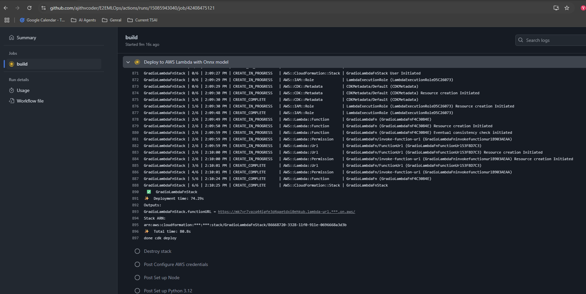

### Deployment - 03 - Deploying a Gradio app with AWS Lambda Service

Note: Kindly check `AWS Cloud formations` to verify that everything is deleted

**Explanation**: First local deployment of Gradio is done for sports classifier and veg fruits classifier and tested with docker. Prodcution grade models are fetched from s3 and kept in "s3_files" folder for both deplpyment. Further they are added to docker container and CDK package is used to push the image to ECR and create lambda service stack.

### Installations

**NPM and Node**

```bash
sudo apt install npm
sudo npm install -g aws-cdk
cdk --version   
```

**cdk using python**
`note`: pwd:= ParentDirectory
```bash
source .venv/bin/activate
python -m pip install -r aws-req.txt
```


### Usage

**Local test for gradio**

- `python app.py` 


**Deploy in AWS**

- `cdk bootstrap aws://${CDK_DEFAULT_ACCOUNT}/${CDK_DEFAULT_REGION}`
- `cdk deploy --require-approval=never`
- `cdk destroy` - Destroy all resources created

Kindly check "AWS Cloud formations" to verify that everything is deleted

### Docker Image Creation

**Build**

- `docker build -t lambdafn -f Dockerfile.lambdafn . --no-cache`

- `docker run   -v /workspaces/E2EMLOps/LambdaFn:/var/task -it -p 8080:8080 lambdafn bash`

    ```
    <debug>
    1. Use to clean the docker builds locally
    docker builder prune --all --force

    2. Dont use COPY . ., there is cdk.out folder which will store the docker images also it will cost around 4B+
    so copy only the required files

    </debug>
    ```

### Results

**Github actions deployment**

- Files are downloaded from s3-prod folder and added to docker container
CDK package is used to push the image to ECR and lmabda service

    

- Sports model prediction

    

- Vegetable-fruits model prediction

    


### References

1. [Setup](https://docs.aws.amazon.com/cdk/v2/guide/getting_started.html) - Getting Started with CDK

2. In case if you decide to push manually to ECR instead of cdk package push you can use below method

    ```bash
    # login
    aws ecr get-login-password --region ${CDK_DEFAULT_REGION} | docker login --username AWS --password-stdin ${CDK_DEFAULT_ACCOUNT}.dkr.ecr.${CDK_DEFAULT_REGION}.amazonaws.com
    # build
    docker build --build-arg AWS_ACCESS_KEY_ID=${AWS_ACCESS_KEY_ID} --build-arg AWS_SECRET_ACCESS_KEY=${AWS_SECRET_ACCESS_KEY} --build-arg AWS_DEFAULT_REGION=${CDK_DEFAULT_REGION} -t lambdafn  -f Dockerfile.lambdafn .
    # tag
    docker tag lambdafn:latest ${CDK_DEFAULT_ACCOUNT}.dkr.ecr.${CDK_DEFAULT_REGION}.amazonaws.com/${REPOSITORY_NAME}:latest

    # test
    docker run --rm -it -p 8080:8080 ${CDK_DEFAULT_ACCOUNT}.dkr.ecr.${CDK_DEFAULT_REGION}.amazonaws.com/${REPOSITORY_NAME}:latest bash

    # push
    docker push ${CDK_DEFAULT_ACCOUNT}.dkr.ecr.${CDK_DEFAULT_REGION}.amazonaws.com/${REPOSITORY_NAME}:latest
    ```

