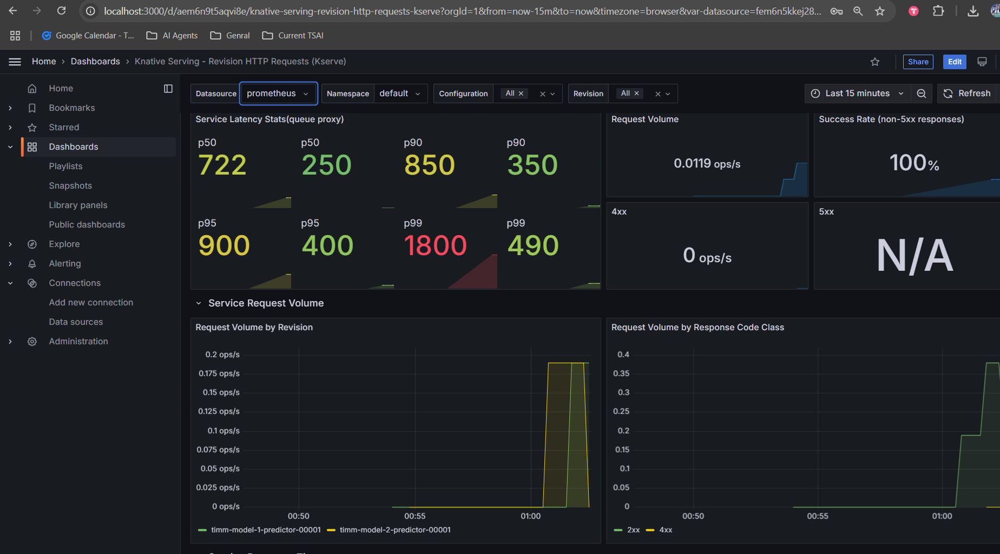
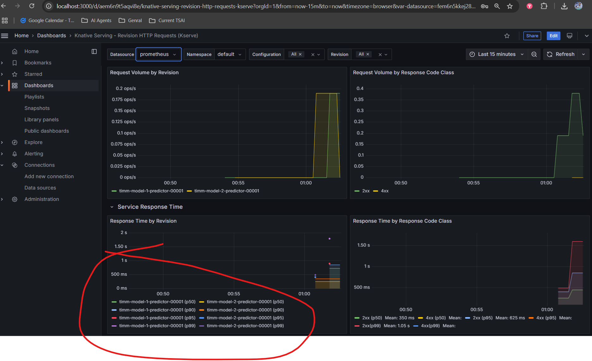
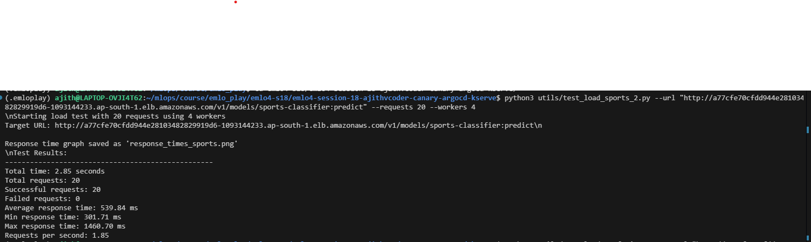
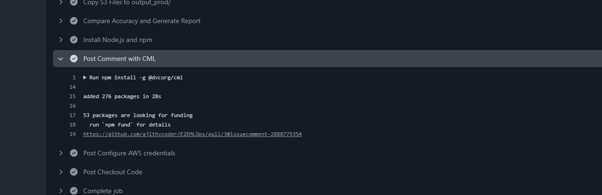

## EMLOV4 Session-18 Capstone Assignment 

**Summary**

Following are the deployments made in this Capstone assignment

1. Deployment 01 - Kubernetes - Train a model with vegetable fruits and sports dataset and perform a argo cd deployment with load testing with github actions.
2. Deployment 02 - Hugging Face - Perform a hugging face deployment with Gradio with github actions.
3. Deployment 03 - AWS Lambda - Perform a AWS Lambda deployment with Gradio with github actions.

### Contents

- [Requirements](#requirements)
- [Deployments](#deployments)
    - [Dataset](#dataset)
    - [Model Development](#model-development)
    - [DVC setup with AWS S3](#dvc-setup-with-aws-s3)
    - [Docker command for train and test](#docker-command-for-train-and-test)
    - [Deployment 01 - Kubernetes](#deployment-01---kubernetes)
        - [Architecture Diagram](#architecture-diagram)
        - [Manual setup](#manual-setup)
            - [D01 Installation](#d01-installation)
            - [Docker images to ECR](#docker-images-to-ecr)
            - [Cluster creation and configuration](#cluster-creation-and-configuration)
            - [ArgoCD Deployment](#argocd-deployment)
            - [Load testing with promethes and Grafana](#load-testing-with-promethes-and-grafana)
            - [Deletion Procedure](#deletion-procedure)
            - [Results Screenshots - D01 Manual](#results-screenshots---d01-manual)
        - [Github actions - Automaing Manual setup End to End - D01](#github-actions---automaing-manual-setup-end-to-end---d01)
            - [Results Screenshots - 01A and 01B Deployment Main](#results-screenshots---01a-and-01b-deployment-main)
            - [Github actions workflow Link - D01A-D01B](#github-actions-workflow-link---d01a-d01b)
            - [Results Screenshots - D01C On PR Request](#results-screenshots---d01c-on-pr-request)
            - [Github actions workflow Link - D01C](#github-actions-workflow-link---d01c)
        - [D01 - Deployment - Video Link](#d01---deployment---video-link)
    - [Deployment 02]
        - [Results Screenshots - D02](#results-screenshots)
    - [Deployment 03 AWS Lambda](#deployment-03---aws-lambda)
        - [D03 - Installations](#d03---installations)
        - [D03 - Usage](#d03---installations)
        - [D03 - Docker Image Creation](#d03---docker-image-creation)
        - [Results Screenshots - D03](#results-screenshots---d03)
        - [Github actions workflow Link - D03](#github-actions-workflow-link---d03)
- [Learnings](#learnings)
- [Technologies Used]

### Requirements
1. On Pull Request to the main branch:
- Trigger a model training process (using EC2 or GitHub Actions Runner).
- Compare the evaluation metrics of the freshly trained model with those of the current production model.

2. On Push to the main branch:
- Retrain the model using the latest dataset.
- Store the updated model in S3. - stage - env
- Update Kubernetes manifest files to reference the new model. - stage
- You can manipulate yaml files using python and push to some new branch
- ArgoCD can listen to this new branch
- Roll out the model to production via ArgoCD.
- Run a stress test to log latency and throughput.
- These can be added as comment to the commit
- Deploy updates to the HuggingFace Hub demo deployment
- Deploy to AWS Lambda as an additional serving endpoint.
might not be required if you’re pulling the model from S3

To successfully complete the capstone project, you must submit:

- A comprehensive architecture diagram illustrating the entire pipeline and deployment process.
- A demonstration video that walks through the end-to-end pipeline, showing each step and its impact.
- The complete code repository containing:
GitHub Actions configuration files.
Kubernetes manifest files and Helm charts.
- An exhaustive README that details:
- The project's structure.
- The process of data management, model training, and deployment.
- Screenshots and explanations of your pipeline in action.
Performance metrics, including latency and stress test results.

Explanation: Deployment 01
Architecture diagram
dvc setup and pull - dataset
start from train and store feature
then go with optuna taking the lowest loss model and saving it - hyper paramter optimization
models usage
onnx model generation
torch script model for usage
mar for torch serve usage
accuracy txt for verification
then transfering the outputs to s3-dev

Now kubernetes
setting up of kserve, knative, argocd, promethus, grafana
show the screenshots on load test

Now deployments workflow
show the ecr repo and docker files
on PR generates a model in dev
compare and post comment in PR

Now kubernetes deployment - github actions 
show the ecr repo and docker all 3 files
explain secrets setup - github workflow
on push to main branch
train and push to stage
setting up of kserve, knative, argocd, 
performs load test
after successfull load test promotes model from stage to dev
comment load test results in commit


### Deployments

### Dataset

**Download Dataset**
```bash
chmod +x shscripts/download_zips.sh && ./shscripts/download_zips.sh
```
**Sports**
```bash
data/processed/sports/
├── sports.csv
├── test
│   ├── air hockey
│   ├── .
│   ├── .
│   ├── .
│   └── wingsuit flying
├── train
│   ├── air hockey
│   ├── .
│   ├── .
│   ├── .
│   └── wingsuit flying
└── valid
    ├── air hockey
    ├── .
    ├── .
    ├── .
    └── wingsuit flying
-----------------------------------------------------
data/processed/vegfruits/
```

### Model Development

Training a model

**Hparams Search**


Torch serve is using onnx model for deployment

**Torchserve - Preparation file**

```bash
    torch-model-archiver --model-name {project}-classifier
    --serialized-file {deploy_dir}/{project}.onnx
    --handler src/backend/torchserve_app/{project}_handler.py
    --export-path {deploy_dir}/model-store/ -f --version 0.0.1
    --extra-files {deploy_dir}/index_to_name.json
```

#### Usage for deployment

Basic train

- `python src/backend/torch_local/train.py experiment=hvegfruits script=true`
- `python src/backend/torch_local/train.py experiment=hsports script=true`

scripts takes care of creating onnx model in checkpoints folder

Eval

- `python src/backend/torch_local/eval.py experiment=evegfruits`
- `python src/backend/torch_local/eval.py experiment=esports`

Take the model and host it with fast api

- host one api in 8080 and another api in 9090

- `python src/backend/fastapi_app/fapi_vegfruits.py` 
- `python src/backend/fastapi_app/fapi_sports.py` 

Move files to s3

- `python src/backend/torch_local/transfer_mar.py `

**Next JS**
There are two choosing buttons and each one redirects to different end points
- End points can be changed in `src/frontend/ui/app/predict_app1` and `src/frontend/ui/app/predict_app2`

- npm run dev


### DVC setup with AWS S3

Run `aws configure` and set the crednetials

Make sure `data/processed/sports` and  `data/processed/vegfruits` are only present and remove other zip files

- `dvc remote add -d myremote s3://mybucket-emlo-mumbai/session-18-data`
- `dvc add data`

Set the S3 URL and push
- `dvc push -r myremote`

### Docker command for train and test

**Training with GPU**

- Build a image for training. Docker file is in root folder.

    `docker build -t emlo-18-train -f Dockerfile .`

- Train a model inside docker and push to s3

    ```
    docker run --gpus=all \
                --name session-18-container \
                --shm-size=8g \
                -v "$(pwd):/workspace" \
                -e AWS_ACCESS_KEY_ID=AWS_ACCESS_KEY_ID \
                -e AWS_SECRET_ACCESS_KEY=AWS_SECRET_ACCESS_KEY+AWS_SECRET_ACCESS_KEY \
                -e AWS_DEFAULT_REGION=AWS_DEFAULT_REGION \
                -e AWS_REGION=AWS_REGION \
                emlo-18-train  \
                /bin/bash -c "
                dvc pull -r myremote && \
                dvc repro -f
                python src/backend/torch_local/transfer_mar.py -p dev
                "
    ```

- `dvc pull -r myremote` - pulls from s3 to local
- `dvc repro -f` - Runs train and test 
- `python src/backend/torch_local/transfer_mar.py -p dev` - Transfers required files like onnx model, pt model, classes.json and accuracy information to `s3 dev` location or the given path in s3.

    ```
    <debug>
    Helpfull for debugging containers locally

    docker run -it --gpus=all \
                --name session-18-container \
                --shm-size=8g \
                -v "$(pwd):/workspace" \
                -e AWS_ACCESS_KEY_ID=AWS_ACCESS_KEY_ID \
                -e AWS_SECRET_ACCESS_KEY=AWS_SECRET_ACCESS_KEY \
                -e AWS_DEFAULT_REGION=AWS_REGION \
                -e AWS_REGION=AWS_REGION \
                emlo-18-train  \
                /bin/bash 
    </debug>
    ```


## Deployment 01 - Kubernetes

**Wait paitently see all deletion is successfull in aws cloud formation stack page and then close the system because some times the deletion gets failed so at backend something would be running and it may cost you high.**

**If you are triggering a spot instance manually with peresistent type ensure that both the spot request is cancelled manually and the AWS instance is terminated finally**

Note: This repo also has the procedure for ArgoCD deployment repo https://github.com/ajithvcoder/emlo4-session-18-ajithvcoder-canary-argocd-kserve

It took two months of effort in every weekend to complete this as a group and it may take you atleast 20$ of AWS cost if you are debugging and developing with AWS for this deployment alone. if you just going to test it , it may cost 0.05 to 1 dollar with github actions.


### Architecture Diagram


### Manual Setup

### D01 Installation

**AWS install**

```
curl "https://awscli.amazonaws.com/awscli-exe-linux-x86_64.zip" -o "awscliv2.zip"
unzip awscliv2.zip
sudo ./aws/install
```

**Provide credentials**

```
aws configure
```

**EKSCTL Install**

```
# for ARM systems, set ARCH to: `arm64`, `armv6` or `armv7`
ARCH=amd64
PLATFORM=$(uname -s)_$ARCH

curl -sLO "https://github.com/eksctl-io/eksctl/releases/latest/download/eksctl_$PLATFORM.tar.gz"

# (Optional) Verify checksum
curl -sL "<https://github.com/eksctl-io/eksctl/releases/latest/download/eksctl_checksums.txt>" | grep $PLATFORM | sha256sum --check

tar -xzf eksctl_$PLATFORM.tar.gz -C /tmp && rm eksctl_$PLATFORM.tar.gz

sudo mv /tmp/eksctl /usr/local/bin
```

**Set the default ssh-gen key in local**

This default ssh key is used by aws for default ssh login

```
ssh-keygen -t rsa -b 4096
```

**Install kubectl for aws eks in your local**

```
curl -O https://s3.us-west-2.amazonaws.com/amazon-eks/1.32.0/2024-12-20/bin/linux/amd64/kubectl

chmod +x ./kubectl

mkdir -p $HOME/bin && cp ./kubectl $HOME/bin/kubectl && export PATH=$HOME/bin:$PATH
```

**Docker**
```
curl -fsSL https://get.docker.com -o get-docker.sh
sudo sh get-docker.sh
```

**Helm**
```
curl -fsSL -o get_helm.sh https://raw.githubusercontent.com/helm/helm/main/scripts/get-helm-3
chmod 700 get_helm.sh
./get_helm.sh
```

**ArgoCD**
```
curl -sSL -o argocd-linux-amd64 https://github.com/argoproj/argo-cd/releases/latest/download/argocd-linux-amd64
sudo install -m 555 argocd-linux-amd64 /usr/local/bin/argocd
# rm argocd-linux-amd64
```

### Docker images to ECR

All below docker images are present [here](./K8SDeploy/src/)

- Build and push docker images to AWS ECR 

**Model server**

Name: model-onnx-server

- Used `pytorch/torchserve-kfs:0.12.0` and installed onnx dependencies. so that K-Serve and Kubernetes inference services can be served with ONNX model also with light weight.


**Web server**

Name: web-server

- `docker build -t web-server -f Dockerfile.web-server .`

**UI server**

Name: ui-server

- `docker build -t ui-server -f Dockerfile.ui-server .`

All above images test in ports like 8080 or 9090 in local and then change to port 80, else its hard to debug in local.

**Use below commands to debug web server and ui server**

- `docker run -it --network my_network -v ./emlo4-s18/E2EMLOps/K8SDeploy/src/web-server:/opt/src -p9090:9090 web-server bash`

- `uvicorn server:app --host 0.0.0.0 --port 9090`


### Cluster creation and configuration

**Cluster creation**

Note: Comment out the `publicKeyPath: /root/.ssh/id_rsa.pub` in cluster file if you are doing in your local as it will take the default ssh file 
from your local.

- `eksctl create cluster -f eks-cluster.yaml`

    

**Metric server config fix**
- `kubectl delete -f https://github.com/kubernetes-sigs/metrics-server/releases/latest/download/components.yaml --validate=false` 

- `kubectl apply -f https://github.com/kubernetes-sigs/metrics-server/releases/latest/download/components.yaml` 

    ```
    kubectl patch deployment metrics-server -n kube-system --type='json' -p='[
        {
            "op": "add",
            "path": "/spec/template/spec/hostNetwork",
            "value": true
        },
        {
            "op": "replace",
            "path": "/spec/template/spec/containers/0/args",
            "value": [
            "--cert-dir=/tmp",
            "--secure-port=4443",
            "--kubelet-preferred-address-types=InternalIP,ExternalIP,Hostname",
            "--kubelet-use-node-status-port",
            "--metric-resolution=15s",
            "--kubelet-insecure-tls"
            ]
        },
        {
            "op": "replace",
            "path": "/spec/template/spec/containers/0/ports/0/containerPort",
            "value": 4443
        }
        ]'
    ```

Reference: 

- [Metric-Server installaiton reference](https://medium.com/@cloudspinx/fix-error-metrics-api-not-available-in-kubernetes-aa10766e1c2f)

**KNative**

- `kubectl apply -f https://github.com/knative/serving/releases/download/knative-v1.16.0/serving-crds.yaml`

- `kubectl apply -f https://github.com/knative/serving/releases/download/knative-v1.16.0/serving-core.yaml`


**ISTIO**

- `kubectl apply -f https://github.com/knative/net-istio/releases/download/knative-v1.16.0/istio.yaml`

- `kubectl apply -f https://github.com/knative/net-istio/releases/download/knative-v1.16.0/net-istio.yaml`

    Patching

    ```
    kubectl patch configmap/config-domain \
        --namespace knative-serving \
        --type merge \
        --patch '{"data":{"emlo.tsai":""}}'
    ```

- `kubectl apply -f https://github.com/knative/serving/releases/download/knative-v1.16.0/serving-hpa.yaml`

- `kubectl apply -f https://github.com/cert-manager/cert-manager/releases/download/v1.16.2/cert-manager.yaml`

Wait and check if everything is up and running

- `kubectl get all -n cert-manager`


**KNative Serving**

- `kubectl apply --server-side -f https://github.com/kserve/kserve/releases/download/v0.14.1/kserve.yaml`

Wait and check if all pods are up

- `kubectl get all -n kserve`


- `kubectl apply --server-side -f https://github.com/kserve/kserve/releases/download/v0.14.1/kserve-cluster-resources.yaml`


**S3 Access creation**

```
eksctl create iamserviceaccount --cluster=basic-cluster-1 --name=s3-read-only --attach-policy-arn=arn:aws:iam::aws:policy/AmazonS3ReadOnlyAccess  --override-existing-serviceaccounts --region ap-south-1 --approve
```

- `kubectl apply -f s3-secret.yaml`

- `kubectl patch serviceaccount s3-read-only -p '{"secrets": [{"name": "s3-secret"}]}'`

**Dashboard, ALB, Charts**

Kubernetes Dashboard

```
helm repo add kubernetes-dashboard https://kubernetes.github.io/dashboard/
helm upgrade --install kubernetes-dashboard kubernetes-dashboard/kubernetes-dashboard --create-namespace --namespace kubernetes-dashboard

kubectl label namespace default istio-injection=enabled
```
ALB
```
eksctl create iamserviceaccount \
    --cluster=basic-cluster-1 \
    --namespace=kube-system \
    --name=aws-load-balancer-controller \
    --attach-policy-arn=arn:aws:iam::306093656765:policy/AWSLoadBalancerControllerIAMPolicy \
    --override-existing-serviceaccounts \
    --region ap-south-1 \
    --approve
```


EKS Charts
```
helm repo add eks https://aws.github.io/eks-charts
helm repo update

helm install aws-load-balancer-controller eks/aws-load-balancer-controller -n kube-system --set clusterName=basic-cluster-1 --set serviceAccount.create=false --set serviceAccount.name=aws-load-balancer-controller
```

**Test URL**

- `kubectl get pods,svc -n istio-system`

The URL that appears in above command can also be seen in `Loadbalancers` apge in AWS

Test if `sports-classifier` works fine with sports s3 models

- `kubectl apply -f sports-classifier.yaml`


Check if everything works and delete it, we need to setup prometheus and grafana

- `python test_kserve_sports_2.py`

Ingress details

```
kubectl get isvc
kubectl get svc -n istio-system
````

Delete classifier after testing

- `kubectl delete -f sports-classifier.yaml`

Till here you can know if everything works fine or not with `python test_kserve_sports_2.py`


**Prometheus**

```
cd other-setup
git clone --branch release-0.14 https://github.com/kserve/kserve.git
cd kserve
kubectl apply -k docs/samples/metrics-and-monitoring/prometheus-operator
kubectl wait --for condition=established --timeout=120s crd/prometheuses.monitoring.coreos.com
kubectl wait --for condition=established --timeout=120s crd/servicemonitors.monitoring.coreos.com
kubectl apply -k docs/samples/metrics-and-monitoring/prometheus
```

```
cd ..
kubectl patch configmaps -n knative-serving config-deployment --patch-file qpext_image_patch.yaml
```

Set max nodes because if you give more request and max is not set it may scale more
Optional step

```
<debug>
eksctl scale nodegroup --cluster=basic-cluster --nodes=6 ng-spot-3 --nodes-max=6
eksctl get nodegroup --cluster basic-cluster --region ap-south-1 --name ng-spot-3
</debug>
```

```
kubectl port-forward service/prometheus-operated -n kfserving-monitoring 9090:9090
```

**Grafana**

```
kubectl create namespace grafana

helm repo add grafana https://grafana.github.io/helm-charts
helm repo update
helm install grafana grafana/grafana --namespace grafana --version 8.8.4
```

```
kubectl get secret --namespace grafana grafana -o jsonpath="{.data.admin-password}" | base64 --decode ; echo
kubectl port-forward svc/grafana 3000:80 -n grafana
```

Setup dashboard for grafana

- Go to Connections-> Add data source -> Prometheus -> Add this prometheus url `http://prometheus-operated.kfserving-monitoring.svc.cluster.local:9090` -> save and test

- Go to Dashboards -> New -> import -> download the json file from here `https://grafana.com/grafana/dashboards/18032-knative-serving-revision-http-requests/` -> upload the json to the specified place


verify

- `kubectl get isvc`

### ArgoCD Deployment

Now clone this [repo](https://github.com/ajithvcoder/emlo4-session-18-ajithvcoder-canary-argocd-kserve) and get inside it

You can also perform canary deployment with this same setup by adding 'canary:30` in the `canary-argocd-kserve` repo

ArgoCD setup

- `kubectl create namespace argocd`

- `kubectl apply -n argocd -f https://raw.githubusercontent.com/argoproj/argo-cd/stable/manifests/install.yaml`

Get Argocd password for login
- `argocd admin initial-password -n argocd`

Check if you are able to access the UI, in codespaces i am not able to forward and access for argocd UI but in local its working
- `kubectl port-forward svc/argocd-server -n argocd 8080:443`

**Argo CD deployment**

Note: I have used [canary-argocd-kserve-repo](https://github.com/ajithvcoder/emlo4-session-18-ajithvcoder-canary-argocd-kserve) repo for deployment of argoCD apps. Please refer to `https://github.com/ajithvcoder/emlo4-session-18-ajithvcoder-canary-argocd-kserve` for argocd repo structure

- Have s3-secret.yaml file in argo-apps/s3-secret.yaml folder and update it with your AWS credentails i.e `AWS_ACCESS_KEY_ID` and `AWS_SECRET_ACCESS_KEY`

```
apiVersion: v1
kind: Secret
metadata:
  name: s3creds
  annotations:
     serving.kserve.io/s3-endpoint: s3.ap-south-1.amazonaws.com # replace with your s3 endpoint e.g minio-service.kubeflow:9000
     serving.kserve.io/s3-usehttps: "1" # by default 1, if testing with minio you can set to 0
     serving.kserve.io/s3-region: "ap-south-1"
     serving.kserve.io/s3-useanoncredential: "false" # omitting this is the same as false, if true will ignore provided credential and use anonymous credentials
type: Opaque
stringData: # use `stringData` for raw credential string or `data` for base64 encoded string
  AWS_ACCESS_KEY_ID: AKXXXXXXXXXXXXXXXXXXXXX
  AWS_SECRET_ACCESS_KEY: "RQHBUNBSJNINQONUKNUKXXXXXX+XQIWOW"

---

apiVersion: v1
kind: ServiceAccount
metadata:
  name: s3-read-only
secrets:
- name: s3creds
```

- Create the argocd repo before you start and update the repo url in `argo-apps/models.yaml` file

Now commit the load balancer url to `emlo4-s18/emlo4-session-18-ajithvcoder-canary-argocd-kserve/fastapi-helm/templates/model-server.cm.yml` file

Change both model-1 and model-2 url


**Deploy Command**

- `kubectl apply -f argo-apps` 


```
<debug>
Delete argocd deployments
kubectl get app -n argocd
kubectl patch app fastapi-helm   -p '{"metadata": {"finalizers": ["resources-finalizer.argocd.argoproj.io"]}}' --type merge -n argocd
kubectl delete app fastapi-helm  -n argocd
</debug>
```

Verify the pods

`kubectl get pods`

### Load testing with promethes and Grafana

Load testing Veg fruits model

- `python3 utils/test_load_vegfruits_2.py`

Load testing Sports model

- `python3 utils/test_load_sports_2.py`

### Deletion Procedure

**Delete argocd deployments**

Verify app name
- `kubectl get app -n argocd`

Delete cascade
- `kubectl patch app model-deployments  -p '{"metadata": {"finalizers": ["resources-finalizer.argocd.argoproj.io"]}}' --type merge -n argocd`
- `kubectl delete app model-deployments -n argocd`

**Deletion of cluster**

- `eksctl delete cluster -f eks-cluster.yaml --disable-nodegroup-eviction`

**Wait paitently see all deletion is successfull in aws cloud formation stack page and then close the system because some times
the deletion gets failed so at backend something would be running and it may cost you high**

**If you are triggering a spot instance manually with `peresistent` type ensure that both the spot request is cancelled manually
and the AWS instance is terminated finally**

### Results Screenshots - D01 Manual

**Ports establishment**


**Argo CD UI**


**Pods getting initialized**


**Load balancers after deployment**
1. For Model serving
2. For UI serving


**Change ALB URLs**

*Note: In github actions deployment its automatically done with github bots.


**Argo CD Commit**


**Pod running**


**UI Prediction**


**Post request**


**Grafana Dashboards**






**Load test - Scale up and down**

- Metric "Request per second" of 5 is the limit and pod scales up when it goes above 5.

- Min and max pod scaling are 1 to 3





**Response time - Load test**

Sports Model


Vegfruits Model


### Github actions - Automaing Manual setup End to End - D01

Two Workflows

1. On Push to Main branch -  [Main Deployment workflow](.github/workflows/01_Deployment_Main.yaml) gets triggered which calls `01A_Deployment_Train_And_Store.yaml` and `01B_Deployment_ArgoCD_And_Promote.yaml`

    **01A Deployment_Train_And_Store**

    a. Internally they trigger a build and push current code with requirements as image to `a18/torch-lightning-train` repo in ECR 

    b. Triggers a spot `g4dn.xlarge` `16 GB` GPU instance with 128 volume and `pytorch 2.6 AMI`

    c. Pulls the image from ECR repo, downloads dataset, Trains and pushes the model to `s3-stage` location 

    **01B Deployment_ArgoCD_And_Promote**

    a. Triggers a ec2 t3a.xlarge as host instance

    b. Setups up a cluster with 3 spot and 1 dedicated instance

    c. Performs all necessary setup for Kserve, ALB, Argo CD, Prometheus, Grafana. Kserve takes care of HPA scaling as it internally has it

    d. Fetches the model from s3-stage and deploys it

    e. performs load test on both the models and if the success rate is more than 90% it moves the model to `s3-prod`

2. On Pull Request to Main branch - [PR Accuracy Test workflow](.github/workflows/01C_Deployment_PR.yaml) gets triggered with calls `01D_Deployment_PR_Train_And_Store.yaml`

    a. Triggers a spot `g4dn.xlarge` `16 GB` GPU instance with 128 volume and `pytorch 2.6 AMI`

    b. Pulls the image from ECR repo, downloads dataset, Trains and pushes the model to `s3-dev` location 

    c. Checks if the model is acheving greater than the accuracy than `s3-prod`, if so makes a comment

ECR Repo 


There are 3 repos
1. a18/ui-server - Next JS UI
2. a18/web-server - Fast API web server
3. model-onnx-server - For serving Kserve + HPA model

- Create following 9 secrets

    

### Results Screenshots - 01A and 01B Deployment Main

**Main Deployment workflow**

1. On push to main branch triggered

2. Train and push to stage

3. Setups argo cd and deploy two models with HPA

    *Fetchs the loabalancer URL and commits to Argo CD repo*

    

    *Live Model*

    

    

4. After successfull load test promotes model from stage to dev  - (screenshot)

    Model 1

    

    Model 2

    

5. Comment after load test results in tested commit  - (screenshot)

    

### Github actions workflow Link - D01A-D01B

- [D01 - Kubernetes - Main - Final workflow Result](https://github.com/ajithvcoder/E2EMLOps/actions/runs/15092736500)

### Results Screenshots - D01C On PR Request

**PR Accuracy Test workflow**

1. Overall actions workflow

    

2. Builds the current code and pushes to ECR repo

    

3. Starts a GPU Spot instance

    

4. Pulls dataset, Trains a model, Compares the accuracy with prod model.

    A output_{project_name}.txt will be generated after every train and it is also available everywhere where ever the model is copies. Thus is can be used for comparision rather than evaluating everytime.

    

5. Stops EC2 Runner

    

6. On PR Request generates a comment

    

    

### Github actions workflow Link - D01C

- [D01C - Kubernetes - On PR - Final workflow Result](https://github.com/ajithvcoder/E2EMLOps/actions/runs/15092490112)

### D01 - Deployment - Video Link

- todo

## Deployment 03 - AWS Lambda

Note: Kindly check `AWS Cloud formations` to verify that everything is deleted

**Explanation**: First local deployment of Gradio is done for sports classifier and veg fruits classifier and tested with docker. Prodcution grade models are fetched from s3 and kept in "s3_files" folder for both deplpyment. Further they are added to docker container and CDK package is used to push the image to ECR and create lambda service stack.

### D03 - Installations

**NPM and Node**

```bash
sudo apt install npm
sudo npm install -g aws-cdk
cdk --version   
```

**cdk using python**
`note`: pwd:= ParentDirectory
```bash
source .venv/bin/activate
python -m pip install -r aws-req.txt
```


### D03 - Usage

**Local test for gradio**

- `python app.py` 


**Deploy in AWS**

- `cdk bootstrap aws://${CDK_DEFAULT_ACCOUNT}/${CDK_DEFAULT_REGION}`
- `cdk deploy --require-approval=never`
- `cdk destroy` - Destroy all resources created

    


Kindly check "AWS Cloud formations" to verify that everything is deleted

### D03 - Docker Image Creation

**Build**

- `docker build -t lambdafn -f Dockerfile.lambdafn . --no-cache`

- `docker run   -v /workspaces/E2EMLOps/LambdaFn:/var/task -it -p 8080:8080 lambdafn bash`

    ```
    <debug>
    1. Use to clean the docker builds locally
    docker builder prune --all --force

    2. Dont use COPY . ., there is cdk.out folder which will store the docker images also it will cost around 4B+
    so copy only the required files

    </debug>
    ```

### Results Screenshots - D03

**Github actions deployment**

- Files are downloaded from s3-prod folder and added to docker container
CDK package is used to push the image to ECR and lmabda service

    

- Sports model prediction

    

- Vegetable-fruits model prediction

    

### Github actions workflow Link - D03

- [D03 - Lambda - Final run workflow link](https://github.com/ajithvcoder/E2EMLOps/actions/runs/15085943040)


### Learnings

1. Learnt about making automated deployment with github actions 

2. If we build a gpu image from github runner then its throwing below error, so i have prebuilt image

```
/opt/conda/lib/python3.11/site-packages/torch/cuda/__init__.py:734: UserWarning: Can't initialize NVML
  warnings.warn("Can't initialize NVML")
```

*Mostly other stuffs are already done in previous assignments and this assignment is a combination of everything.

## Technologies Used

[PyTorch Lightning](https://github.com/PyTorchLightning/pytorch-lightning) - a lightweight PyTorch wrapper for high-performance AI research. Think of it as a framework for organizing your PyTorch code.

[Hydra](https://github.com/facebookresearch/hydra) - a framework for elegantly configuring complex applications. The key feature is the ability to dynamically create a hierarchical configuration by composition and override it through config files and the command line.

[DVC](https://dvc.org/) - A tool designed to handle large datasets and machine learning models in a version-controlled workflow

[Tensorboard|wandb](https://www.tensorflow.org/tensorboard) - TensorBoard is a tool that provides visualization and debugging capabilities for TensorFlow and PyTorch experiments. It’s a popular choice for monitoring machine learning training processes in real time.

[AWS|EC2|S3|Lambda|ECR](https://aws.amazon.com/ec2/) - AWS Elastic Compute Cloud (EC2) is a service that provides scalable virtual computing resources in the cloud.

[Docker](https://www.docker.com/) - A platform for creating, deploying, and managing lightweight, portable, and scalable containers.

[FastAPI|Gradio](https://www.gradio.app/) - A Python library for building simple, interactive web interfaces for machine learning models and APIs.

[Nextjs]() - Frontend FrameWork

[K8s|KNative|Kserve|Istio|ArgoCD]() - AWS Kubernets and ArgoCD 

[Prometheus|Grafana] - observability


[](https://github.com/ashleve/lightning-hydra-template#license)